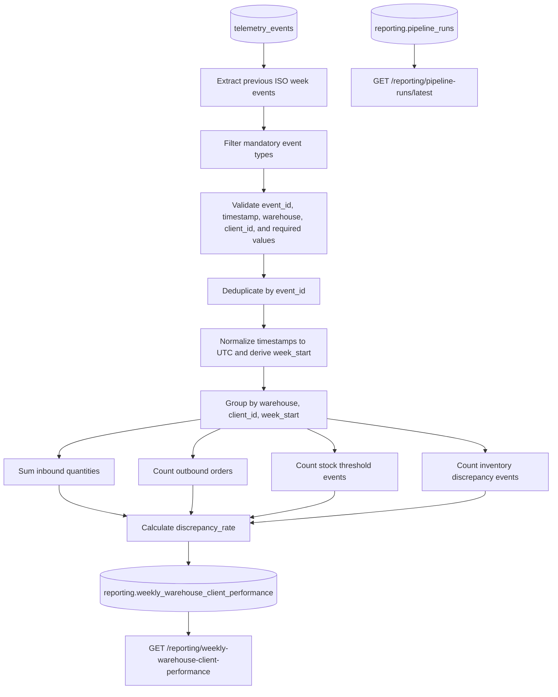

# TrackFlow Business Performance Pipeline Design

## Overview

This document defines the design for a new business performance data pipeline for TrackFlow.

The pipeline reads from the existing `telemetry_events` table and produces a weekly operational report for business leadership. It does not replace or modify the existing engineering telemetry system.

The following existing components remain unchanged:

- `telemetry_events`
- `services/telemetry/analysis.py`
- `GET /telemetry/report`

The new pipeline writes its output to tables under the `reporting` schema and exposes the results through a new `services/reporting/` module.

---

# Phase 1 — Current State Analysis

## Current State

TrackFlow currently captures operational and technical events in the `telemetry_events` table.

The business events relevant to this pipeline are:

| Event type | Business meaning |
|---|---|
| `inbound_order_created` | A warehouse received an inbound order containing client inventory |
| `outbound_order_created` | A warehouse created an outbound order for a client |
| `stock_threshold_triggered` | A client's SKU fell below the configured minimum stock threshold |
| `inventory_discrepancy_detected` | A difference was detected between expected and recorded inventory |

These events are stored as individual telemetry records and include the event envelope and tags required to identify the warehouse, client, quantity, order, and event timestamp.

TrackFlow also has an existing technical telemetry report exposed through:

```text
GET /telemetry/report
```

That report answers engineering-focused questions such as:

- How many events are being received
- Whether event processing errors are occurring
- Which technical event types are most common
- Whether telemetry ingestion is operating correctly
- Whether latency or technical reliability problems exist

The technical report is intended for engineers and is not designed to produce executive business KPIs.

## Business Gap

The existing technical telemetry report does not answer the following business question:

> How did each TrackFlow warehouse perform for each client during the previous ISO week in terms of inbound volume, outbound throughput, stockout activity, and inventory accuracy?

Thomas, the CEO, and Ana, the Head of Warehouse Operations, currently need a weekly per-warehouse and per-client performance report. The required values cannot be reliably obtained from the engineering report because the technical report does not aggregate business events by warehouse, client, and ISO week.

A dedicated business data pipeline is therefore required.

---

# Phase 2 — Pipeline Design

## Pipeline Purpose

The purpose of this pipeline is to produce the **Weekly Warehouse & Client Performance Report** for Thomas and Ana every Monday morning by calculating Inbound Volume, Outbound Throughput, Stockout Frequency, and Discrepancy Rate for every warehouse and client from `inbound_order_created`, `outbound_order_created`, `stock_threshold_triggered`, and `inventory_discrepancy_detected` telemetry events.

## Business Deliverable

The pipeline produces:

```text
Weekly Warehouse & Client Performance Report
```

Audience:

- Thomas, CEO
- Ana, Head of Warehouse Operations

Cadence:

- Weekly
- Fresh by Monday morning
- Each scheduled run computes the previous completed ISO week

Required grain:

```text
One row per warehouse, per client_id, per ISO week
```

The `week_start` value is the Monday of the ISO week in UTC.

## KPIs

| KPI | Output field | Computation |
|---|---|---|
| Inbound Volume | `inbound_units_count` | Sum of inbound quantities from `inbound_order_created` |
| Outbound Throughput | `outbound_orders_count` | Count of `outbound_order_created` events |
| Stockout Frequency | `stockout_events_count` | Count of `stock_threshold_triggered` events |
| Discrepancy Rate | `discrepancy_rate` | `discrepancy_events_count / outbound_orders_count` |

Supporting field:

| Field | Computation |
|---|---|
| `discrepancy_events_count` | Count of `inventory_discrepancy_detected` events |

When `outbound_orders_count` is zero, `discrepancy_rate` is stored as `0`.

## Source Data

The primary source is:

```text
telemetry_events
```

Only the following event types are extracted in v1:

```text
inbound_order_created
outbound_order_created
stock_threshold_triggered
inventory_discrepancy_detected
```

No other telemetry event types are required for the first version.

The pipeline reads `telemetry_events` in read-only mode.

## Extraction Format

The data arrives as rows in the PostgreSQL `telemetry_events` table.

Each row contains the telemetry event envelope and event-specific values, including the following logical fields:

- Unique event identifier
- `event_type`
- Event timestamp
- Warehouse
- `client_id`
- Quantity when applicable
- Order or entity identifiers inside the event tags or payload
- Event metadata and tags

The expected warehouse values are:

```text
los_angeles
zaragoza
```

The pipeline executes weekly on Monday morning and extracts the previous completed ISO week.

For example, a run on Monday, July 20, 2026 processes:

```text
2026-07-13T00:00:00Z
through
2026-07-20T00:00:00Z
```

The lower boundary is inclusive and the upper boundary is exclusive.

A manual run may also accept a specific `week_start`.

## Data Flow



The pipeline has three clearly separated stages:

1. Extraction
2. Transformation
3. Load

## Extraction Stage

The extraction stage:

1. Determines the target ISO week.
2. Queries `telemetry_events` using the event timestamp.
3. Filters to the four mandatory business event types.
4. Reads only events inside the requested weekly interval.
5. Captures the highest event timestamp or event identifier processed as a checkpoint.
6. Records the number of extracted rows in the pipeline execution log.

The extraction query uses:

```text
event_timestamp >= week_start
event_timestamp < week_start + 7 days
```

## Transformation Stage

The transformation stage performs the following operations:

1. Rejects records without a valid event identifier.
2. Rejects records without a valid event timestamp.
3. Rejects records without `warehouse`.
4. Rejects records without `client_id`.
5. Validates warehouse values.
6. Deduplicates events using the telemetry event identifier.
7. Normalizes event timestamps to UTC.
8. Derives the ISO Monday `week_start`.
9. Groups events by:

```text
warehouse
client_id
week_start
```

10. Computes the required KPI fields.

### KPI Logic

#### Inbound Volume

For each `inbound_order_created` event:

```text
inbound_units_count += quantity
```

#### Outbound Throughput

For each unique `outbound_order_created` event:

```text
outbound_orders_count += 1
```

#### Stockout Frequency

For each unique `stock_threshold_triggered` event:

```text
stockout_events_count += 1
```

#### Discrepancy Count

For each unique `inventory_discrepancy_detected` event:

```text
discrepancy_events_count += 1
```

#### Discrepancy Rate

```text
discrepancy_rate =
    discrepancy_events_count / outbound_orders_count
```

When there are no outbound orders:

```text
discrepancy_rate = 0
```

## Handling Updated Source Records

The primary telemetry source is expected to be append-oriented, but the design also protects against records that are updated after initial insertion.

The concrete update strategy is:

1. Use the telemetry event identifier as the source-record key.
2. Use the event's last-modified timestamp, when available, to identify newer versions.
3. During extraction, retain only the most recent version of each event identifier.
4. Recompute the complete target warehouse/client/week aggregate rather than incrementing a previously stored value.
5. Upsert the recomputed result into the reporting table using:

```text
warehouse
client_id
week_start
```

If a source event changes, the next run recomputes its complete weekly aggregate and replaces the corresponding reporting row.

This avoids double counting an old and updated version of the same event.

## Duplicate Prevention

Duplicate prevention occurs at two layers.

### Event Layer

The telemetry event identifier is the deduplication key.

Within the extracted weekly dataset, only one record for each event identifier is processed.

When multiple versions exist, the latest version is selected using the last-modified timestamp or ingestion timestamp.

### Reporting Layer

The destination table has this unique constraint:

```sql
unique (warehouse, client_id, week_start)
```

The pipeline uses an upsert rather than a plain insert.

Therefore, repeated runs cannot create duplicate warehouse/client/week rows.

## Destination Table

The primary output table is:

```sql
create schema if not exists reporting;

create table reporting.weekly_warehouse_client_performance (
  id uuid primary key default gen_random_uuid(),
  warehouse text not null,
  client_id text not null,
  week_start date not null,
  inbound_units_count integer not null default 0,
  outbound_orders_count integer not null default 0,
  stockout_events_count integer not null default 0,
  discrepancy_events_count integer not null default 0,
  discrepancy_rate numeric not null default 0,
  computed_at timestamptz not null default now(),
  unique (warehouse, client_id, week_start)
);
```

The pipeline also requires a reusable execution-log table:

```sql
create table reporting.pipeline_runs (
  id uuid primary key default gen_random_uuid(),
  pipeline_name text not null,
  target_week_start date,
  trigger_type text not null,
  status text not null,
  started_at timestamptz not null,
  ended_at timestamptz,
  extracted_records integer not null default 0,
  processed_records integer not null default 0,
  loaded_records integer not null default 0,
  rejected_records integer not null default 0,
  duplicate_records integer not null default 0,
  source_interval_start timestamptz,
  source_interval_end timestamptz,
  highest_event_timestamp timestamptz,
  checkpoint_value text,
  error_message text,
  prefect_flow_run_id text,
  created_at timestamptz not null default now()
);
```

## Load Stage

The load stage writes transformed rows to:

```text
reporting.weekly_warehouse_client_performance
```

Each row is loaded with an upsert using:

```text
warehouse
client_id
week_start
```

Conceptual SQL:

```sql
insert into reporting.weekly_warehouse_client_performance (
  warehouse,
  client_id,
  week_start,
  inbound_units_count,
  outbound_orders_count,
  stockout_events_count,
  discrepancy_events_count,
  discrepancy_rate,
  computed_at
)
values (...)
on conflict (warehouse, client_id, week_start)
do update set
  inbound_units_count = excluded.inbound_units_count,
  outbound_orders_count = excluded.outbound_orders_count,
  stockout_events_count = excluded.stockout_events_count,
  discrepancy_events_count = excluded.discrepancy_events_count,
  discrepancy_rate = excluded.discrepancy_rate,
  computed_at = excluded.computed_at;
```

The entire load for one week should execute inside a database transaction.

## Late Events

A telemetry event may arrive after the weekly report has already been computed.

Late events are handled by recomputing the entire affected ISO week.

The scheduled Monday run computes the previous week, and later scheduled runs may also recompute a configurable lookback window, such as the previous two completed weeks.

The manual trigger endpoint may request a specific `week_start`.

When a late event is found:

1. The entire affected warehouse/client/week aggregate is recomputed from source.
2. The existing reporting row is replaced through the upsert.
3. `computed_at` is updated.
4. A new pipeline execution-log row records the recomputation.
5. Previous pipeline-run records remain unchanged, preserving the audit history.

This corrects the published metric without adding duplicate values or deleting the audit trail.

---

# Phase 3 — Resilience and Idempotency

## Idempotency Strategy

The pipeline is idempotent because it recomputes complete weekly aggregates and upserts them using the destination table's unique business key:

```text
warehouse
client_id
week_start
```

Running the pipeline multiple times for the same week produces the same final business values as one successful run over that source data.

The pipeline never increments existing aggregate fields.

It calculates fresh values from the source and replaces the existing fields.

## Re-run After a Load Failure

Assume a run produces ten aggregate rows and the database connection fails after five rows have been written.

The recovery behavior is:

1. The failed run is marked `Failed` in `reporting.pipeline_runs`.
2. No success checkpoint is advanced.
3. The next run extracts and transforms the full target week again.
4. It recalculates all ten aggregate rows from source.
5. It upserts all ten rows using the unique key.
6. The five rows written by the failed attempt are updated with the same recalculated values.
7. The five missing rows are inserted.
8. The successful rerun is recorded as a new execution-log entry.

When the load is wrapped in one transaction, the failed load is rolled back entirely.

Even if partial writes occur because of an external interruption, the upsert behavior still makes the second run converge to the same result as a clean run.

## Checkpoint Strategy

A checkpoint is recorded only after a successful load transaction.

The checkpoint includes:

- Pipeline name
- Target `week_start`
- Source interval start
- Source interval end
- Highest processed event timestamp
- Highest processed event identifier when applicable
- Successful flow-run identifier
- Completion timestamp

A failed run does not replace the last successful checkpoint.

Because the pipeline recomputes complete weekly partitions, it can safely resume by rerunning the failed week rather than starting after a potentially partial row.

## Database Outage Recovery

When a database operation fails:

1. The affected task retries according to the configured retry policy.
2. The error is recorded in Prefect and `reporting.pipeline_runs`.
3. The current run is marked `Failed` if retries are exhausted.
4. The success checkpoint is not updated.
5. The next run restarts from the target week's extraction boundary.
6. The complete target-week aggregates are recalculated and upserted.

## Concurrent Runs

A scheduled run and a manual trigger could attempt to process the same week simultaneously.

The design prevents load race conditions through:

1. A pipeline-level concurrency limit of one for the weekly performance flow.
2. A lock based on:

```text
pipeline_name + target_week_start
```

3. A check for an existing `Running` execution-log row for the same pipeline and week.
4. The destination unique constraint.
5. Transactional upserts.

If another run already owns the lock, the second request should return a conflict response or create a run in a waiting state rather than starting a competing load.

A stale lock can be released after its owning run is confirmed failed or timed out.

## Source Transmission Retries

Retries of `POST /telemetry` must use the event identifier as an idempotency key.

The server should enforce uniqueness for that event identifier.

Expected server behavior:

- A newly stored event returns a successful created response.
- A retry of an already stored identical event returns a successful idempotent response indicating it already exists.
- A malformed event returns a non-retryable validation response.
- A temporary database or server error returns a retryable server-error response.

The business pipeline still deduplicates by event identifier as a second layer of protection.

## Frontend Buffering

Short-term browser buffering may be useful when a client temporarily loses connectivity, but it should not own business aggregation or long-term delivery guarantees.

Risks include:

- Duplicate transmission
- Lost browser storage
- Events arriving out of order
- Delayed events
- Stale client clocks
- Sensitive data remaining on the device

The frontend may retry buffered telemetry using the same event identifier, but the server owns validation, deduplication, persistence, and idempotency.

## Silence Versus True Absence

A weekly count of zero does not automatically prove there was no business activity.

The pipeline distinguishes true zero activity from a telemetry or pipeline failure by recording:

- Whether the scheduled flow ran
- Whether extraction completed
- Number of source records extracted
- Number of records processed
- Number of records rejected
- Number of duplicate records
- Source interval boundaries
- Last event timestamp
- Pipeline status
- Capture health indicators
- Error information

A successful run with zero extracted records means no matching events were found.

A missing or failed run means the period cannot be confidently interpreted as zero activity.

## Collection Traceability

The following values support tracing an event into the business report:

- Telemetry event identifier
- Event type
- Event timestamp
- Warehouse
- `client_id`
- Source interval
- Target `week_start`
- Prefect flow-run identifier
- Pipeline execution-log identifier
- Extracted-record count
- Processed-record count
- Rejected-record count
- Duplicate-record count
- Loaded aggregate count
- Computation timestamp

Detailed task logs should make it possible to trace which weekly partition and source event range produced each report.

## Growth Versus Data Loss

Event volume changes are evaluated with supporting operational signals rather than interpreted in isolation.

Useful comparisons include:

- Current extracted count versus previous weeks
- Events per warehouse
- Events per client
- Event counts by event type
- Duplicate rate
- Rejection rate
- Delay between event time and ingestion time
- Number of active warehouse/client combinations
- Pipeline run status
- Telemetry capture status

A volume increase accompanied by stable duplicate and rejection rates may indicate real growth.

A sudden decrease accompanied by capture failures, missing warehouses, missing clients, or an increased ingestion delay may indicate data loss.

## Execution Log

Every run records at least the following fields:

| Field | Data type | Why it is required |
|---|---|---|
| `id` | UUID | Uniquely identifies the pipeline run |
| `pipeline_name` | Text | Identifies which pipeline produced the log |
| `target_week_start` | Date | Identifies the weekly partition processed |
| `trigger_type` | Text | Distinguishes scheduled and manual runs |
| `status` | Text | Shows whether the run is Running, Completed, or Failed |
| `started_at` | Timestamptz | Establishes when processing began |
| `ended_at` | Timestamptz, nullable | Establishes completion time and duration |
| `extracted_records` | Integer | Shows how many source records were read |
| `processed_records` | Integer | Shows how many records passed transformation |
| `loaded_records` | Integer | Shows how many aggregate rows were written |
| `rejected_records` | Integer | Reveals invalid source data |
| `duplicate_records` | Integer | Reveals duplicate source events |
| `source_interval_start` | Timestamptz | Records the inclusive extraction boundary |
| `source_interval_end` | Timestamptz | Records the exclusive extraction boundary |
| `highest_event_timestamp` | Timestamptz, nullable | Shows the newest source event included |
| `checkpoint_value` | Text, nullable | Identifies the successful recovery position |
| `error_message` | Text, nullable | Explains why a failed run failed |
| `prefect_flow_run_id` | Text, nullable | Links the database audit record to Prefect |
| `created_at` | Timestamptz | Preserves when the log record was created |

These fields allow operators to audit both data movement and execution behavior.

---

# Phase 4 — Mapping to Prefect

## Prefect Flows

### Flow 1: `weekly_warehouse_client_performance_flow`

Purpose:

- Orchestrates the full weekly extraction, transformation, validation, and load process.

Responsibilities:

1. Resolve the target ISO week.
2. Acquire the pipeline/week lock.
3. Create the execution-log record.
4. Run extraction.
5. Run transformation.
6. Validate aggregate results.
7. Load reporting rows.
8. Persist the successful checkpoint.
9. Complete the execution log.
10. Release the lock.

### Flow 2: `recompute_weekly_performance_flow`

Purpose:

- Recomputes a specific historical week for late events, corrections, or a manual request.

Responsibilities:

1. Accept an explicit `week_start`.
2. Validate that it is an ISO Monday.
3. Invoke the weekly aggregation tasks for that specific partition.
4. Replace the existing reporting rows through upsert.
5. Record the recomputation as a separate pipeline run.

### Optional Flow 3: `weekly_performance_backfill_flow`

Purpose:

- Processes multiple historical weeks during initial deployment or controlled backfills.

It invokes `recompute_weekly_performance_flow` once per requested ISO week.

## Prefect Tasks

### `extract_weekly_business_events`

Stage:

```text
Extraction
```

Responsibilities:

- Query `telemetry_events`
- Filter the four required event types
- Restrict the query to the weekly interval
- Return source records and extraction metadata

### `deduplicate_and_validate_events`

Stage:

```text
Transformation
```

Responsibilities:

- Validate required event fields
- Deduplicate by event identifier
- Select the latest record version when duplicates exist
- Separate rejected records
- Return clean business events

### `aggregate_weekly_warehouse_client_metrics`

Stage:

```text
Transformation
```

Responsibilities:

- Derive UTC ISO `week_start`
- Group by warehouse and `client_id`
- Calculate inbound units
- Count outbound orders
- Count stockout events
- Count discrepancy events
- Calculate discrepancy rate

### `validate_weekly_metrics`

Stage:

```text
Transformation validation
```

Responsibilities:

- Reject negative counts
- Confirm valid warehouse values
- Confirm non-empty `client_id`
- Confirm discrepancy rate is not negative
- Confirm one result per warehouse/client/week key

### `upsert_weekly_performance_rows`

Stage:

```text
Load
```

Responsibilities:

- Open a transaction
- Upsert records into `reporting.weekly_warehouse_client_performance`
- Commit all rows together
- Return the loaded-row count

### `create_pipeline_run_log`

Responsibilities:

- Insert the initial `Running` execution-log record

### `complete_pipeline_run_log`

Responsibilities:

- Update counts, checkpoint, completion time, and `Completed` status

### `fail_pipeline_run_log`

Responsibilities:

- Record failure time, error message, and `Failed` status

## Prefect States

### Running

Relevant while:

- Extraction is querying the source
- Transformation is calculating aggregates
- Validation is checking output
- Load is writing destination rows

The matching `reporting.pipeline_runs` record has:

```text
status = Running
```

### Completed

Used only when:

- Extraction succeeded
- Transformation succeeded
- Validation succeeded
- The load transaction committed
- The successful checkpoint was saved
- The execution-log record was completed

### Failed

Used when:

- Source extraction fails
- Required fields are unusable beyond the allowed threshold
- Transformation fails
- Validation fails
- The database load fails
- The execution log cannot be reliably completed

A failed state does not advance the success checkpoint.

## Retries

Recommended retry behavior:

- Extraction task: three retries with exponential backoff
- Load task: three retries with exponential backoff
- Execution-log updates: limited retries
- Validation failures: no automatic retry unless the failure is caused by infrastructure

Retries are safe because extraction is read-only and load uses idempotent upserts.

## Prefect Blocks

The following configuration should be stored as Prefect blocks or equivalent secret/configuration blocks:

### `trackflow-supabase-database`

Contains:

- Supabase PostgreSQL host
- Port
- Database name
- Username
- Password
- SSL settings
- Connection timeout

### `trackflow-reporting-settings`

Contains:

- Default timezone: UTC
- Scheduled weekday: Monday
- Scheduled execution time
- Late-event lookback period
- Allowed warehouse values
- Pipeline concurrency limit
- Retry configuration

### `trackflow-reporting-api-secrets`

Contains any internal authentication secret required by:

```text
POST /reporting/pipeline-runs
```

Credentials must never be committed directly to the repository.

---

# Phase 5 — Application Integration

## Module Separation

The reporting API will live under:

```text
services/reporting/
```

The ETL and orchestration logic will live under:

```text
data/pipelines/
```

The API may import and call pipeline functions.

Pipeline code must not import the HTTP service layer.

No ETL logic belongs inside `services/reporting/`.

## Planned Files

```text
data/
  pipelines/
    PIPELINE_DESIGN.md
    weekly_warehouse_client_performance.py

services/
  reporting/
    __init__.py
    routes.py
    schemas.py
```

Implementation file names are planned only; no orchestration code is required in this milestone.

## Endpoint 1: Weekly Performance Query

```http
GET /reporting/weekly-warehouse-client-performance
```

Optional query parameter:

```text
week_start=YYYY-MM-DD
```

Behavior:

- When `week_start` is provided, return all warehouse/client rows for that ISO week.
- When it is omitted, return the most recently computed week.
- Query only `reporting.weekly_warehouse_client_performance`.
- Do not query or modify `telemetry_events`.

Example response:

```json
{
  "week_start": "2026-07-13",
  "entries": [
    {
      "warehouse": "los_angeles",
      "client_id": "fashion-co",
      "inbound_units_count": 4200,
      "outbound_orders_count": 980,
      "stockout_events_count": 3,
      "discrepancy_events_count": 2,
      "discrepancy_rate": 0.002
    }
  ]
}
```

The route imports:

```python
from data.pipelines.weekly_warehouse_client_performance import (
    get_weekly_warehouse_client_performance,
)
```

The service calls:

```text
get_weekly_warehouse_client_performance(week_start)
```

This function contains or delegates the reporting-table query logic.

## Endpoint 2: Latest Pipeline Run

```http
GET /reporting/pipeline-runs/latest
```

Behavior:

- Returns the latest execution-log record for the weekly performance pipeline.
- Includes status, timestamps, counts, target week, checkpoint, and error information.

The route imports:

```python
from data.pipelines.weekly_warehouse_client_performance import (
    get_latest_pipeline_run,
)
```

The service calls:

```text
get_latest_pipeline_run()
```

## Endpoint 3: Manual Pipeline Trigger

```http
POST /reporting/pipeline-runs
```

Request body:

```json
{
  "week_start": "2026-07-13"
}
```

Behavior:

1. Validates authorization.
2. Validates that `week_start` is a Monday.
3. Checks whether the same pipeline/week is already running.
4. Starts the Prefect recomputation flow.
5. Returns the new flow-run and execution-log identifiers.

The route imports:

```python
from data.pipelines.weekly_warehouse_client_performance import (
    trigger_weekly_performance_run,
)
```

The service calls:

```text
trigger_weekly_performance_run(week_start)
```

The service does not contain extraction, transformation, aggregation, deduplication, or load logic.

Example accepted response:

```json
{
  "status": "accepted",
  "week_start": "2026-07-13",
  "pipeline": "weekly_warehouse_client_performance"
}
```

A concurrent request for the same week may return:

```http
409 Conflict
```

## Out-of-Scope Components

The following are not modified:

```text
telemetry_events
services/telemetry/analysis.py
GET /telemetry/report
```

The pipeline does not write back into the telemetry source.

---

# Design Acceptance Checklist

- [x] The design targets the Weekly Warehouse & Client Performance Report.
- [x] The business audience is Thomas and Ana.
- [x] The cadence is weekly and fresh by Monday morning.
- [x] The design uses only the four required TrackFlow event types.
- [x] The design calculates all four required KPIs.
- [x] The grain is warehouse, client, and ISO week.
- [x] The extraction, transformation, and load stages are separate.
- [x] Source updates are handled through event-key deduplication and complete partition recomputation.
- [x] Destination rows are idempotently upserted.
- [x] Late events trigger complete weekly recomputation.
- [x] Execution logging contains field names, types, and audit justifications.
- [x] At least two Prefect flows are named.
- [x] At least three Prefect tasks are named.
- [x] Prefect states and blocks are documented.
- [x] Reporting endpoints are separate from telemetry endpoints.
- [x] The status and manual-trigger endpoints identify the pipeline functions they call.
- [x] No ETL logic is placed in the service layer.

## Script Execution

Run the weekly business performance pipeline from the repository root:

```bash
python data/pipelines/pipeline.py
```

The default execution processes the previous completed ISO week. The intended production schedule is every Monday morning in UTC.
